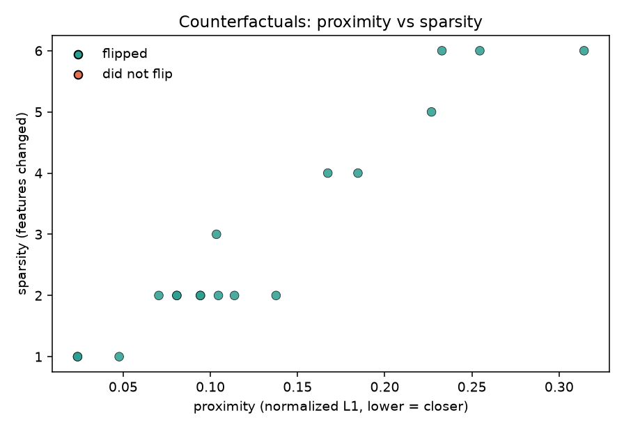
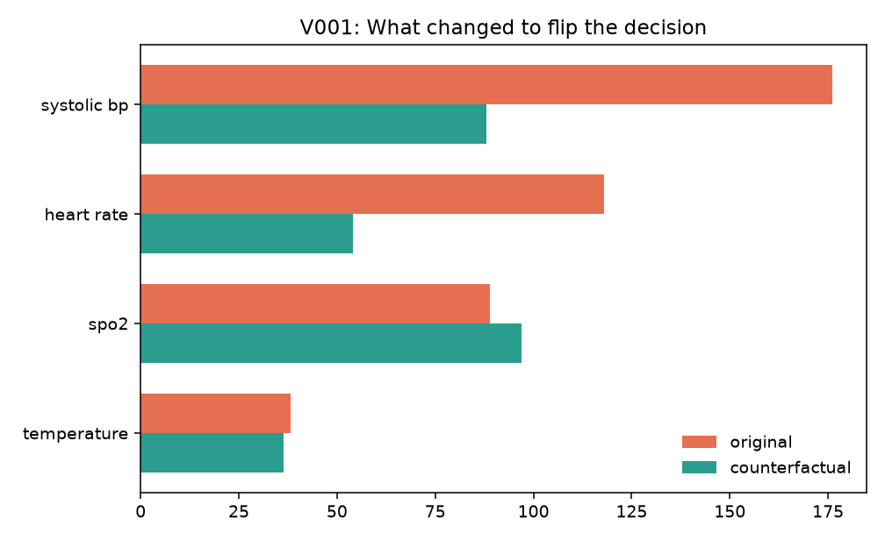

# Counterfactual Ward

**In one sentence:** a model says a (made-up) patient is high risk; this code asks “what is the smallest realistic change that would make the same model say low risk?”

## What this does

Each patient has vitals, labs, and a short clinical note. A logistic model predicts **high 30-day risk**. For a person the model already flagged, the search tries cheap, actionable edits first (lower blood pressure, raise SpO2, swap a worrying phrase in the note) and avoids things you cannot change (age, sex).

The result is a card: original prediction, edited prediction, and the handful of fields that moved. That is an explanation of the **classifier**, not a treatment plan. The patients are synthetic.



*Each point is one counterfactual. Lower proximity = closer to the original patient. Sparsity = how many fields changed. Green = the prediction actually flipped.*



*Original vs counterfactual values on the fields the search was allowed to touch.*

## How it works

1. Train on tabular features + TF-IDF of the note.
2. Greedy coordinate steps in the actionable direction, then a short random search, then a fallback that pushes vitals toward a healthier or sicker pole.
3. Cost = normalized change × actionability weight.
4. Report validity (did the label flip?), proximity, and sparsity.

Shipped examples live in `data/vignettes.json`. The demo trains on a larger generated cohort so the text model has enough notes.

## How to run

```text
python -m pip install -r requirements.txt
python demo.py
python -m pytest -q
```

Human-readable cards are written to `outputs/cf_cards.md`.

MIT License
